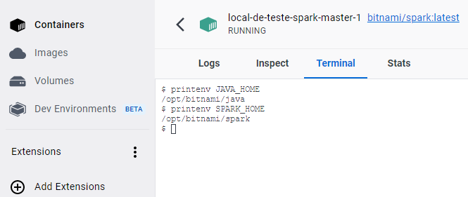
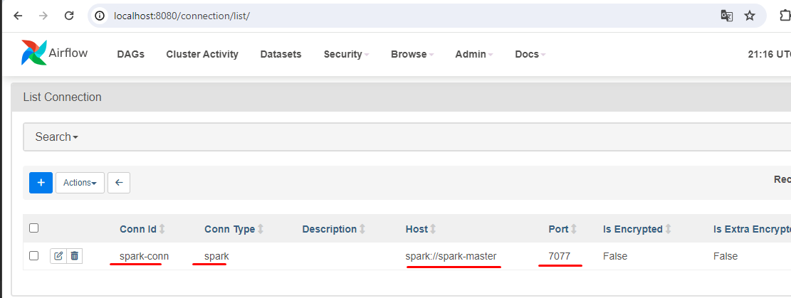
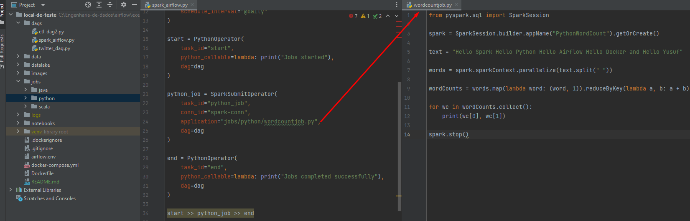
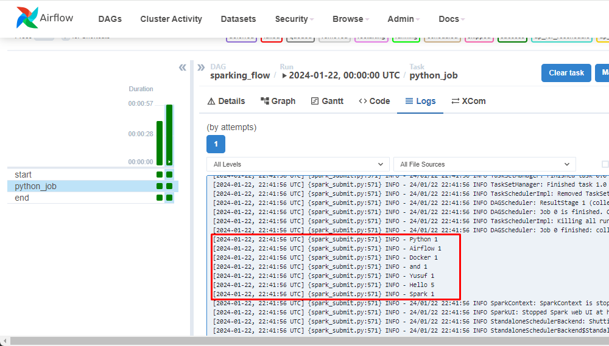
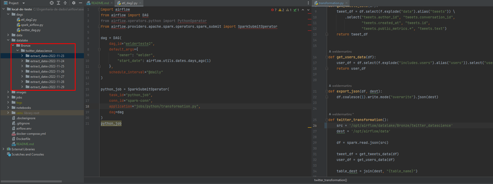

###  O contexto do projeto será normalizar os arquivos json que estão dentro da pasta Datalake, utilizando o Airflow como orquestrador e o Spark para ingestão.

### Execute o comando para criar a imagem e container 
```bash
docker-compose up -d --build 
```

### Execute o comando para subir o container
```bash
docker-compose up -d 
```

### O arquivo Dockerfile irá baixar e setar as variaveis:</br>
* Java
* python
* spark</br>
</br>
    

### Criando a conexão Spark no Airflow </br>
</br>

### A primeira DAG irá fazer uma contagem de cada palavra de um texto </br>
</br>

### A primeira DAG irá fazer uma contagem de cada palavra de um texto </br>
 </br>

### Retorno da DAG </br>
 </br>


### Segunda Dag traz um exemplo de normalização de dados </br>
 </br>

